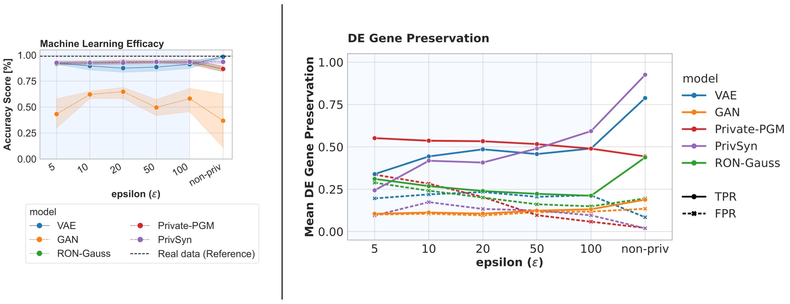

# PRO-GENE-GEN
[](LICENSE)


*On the left side, we illustrate the performance of various privacy models based on a standard Machine Learning Efficacy metric. This evaluation assesses the utility of each model in downstream machine learning tasks. Conversely, on the right side, we evaluate the models using a biological metric known as Co-Expression Preservation. This specific metric examines whether models can maintain the co-expression patterns observed in the actual data, with a focus on Pearson correlation values greater than 0.The **X-axis** across both evaluations represents a range of privacy budgets, spanning from relatively low to high. This axis allows us to compare the impact of different privacy levels on model performance. Additionally, **Real data (reference)** is depicted, which pertains to the metrics obtained directly from the real data (comparison of training versus test datasets). This serves as a benchmark or oracle score, indicating the optimal performance that models aim to achieve.*


This repository contains the implementation for ["Towards Biologically Plausible and Private Gene Expression Data Generation" (PoPETs 2024)]().

*Authors: Dingfan Chen, Marie Oestreich, Tejumade Afonja, Raouf Kerkouche, Matthias Becker, and Mario Fritz*

Contact: Dingfan Chen ([dingfan.chen@cispa.de](mailto:dingfan.chen@cispa.de)), Marie Oestreich ([Marie.Oestreich@dzne.de](mailto:marie.oestreich@dzne.de)), or Tejumade Afonja ([tejumade.afonja@cispa.de](mailto:tejumade.afonja@cispa.de))

> <b>Code coming soon.</b>


## Citation
```bibtex
@article{afonja2023margctgan,
  title={Towards Biologically Plausible and Private Gene Expression Data Generation},
  author={Chen, Dingfan and Oestreich, Marie and Afonja, Tejumade and Kerkouche, Raouf and Becker, Matthias and Fritz, Mario},
  journal={arXiv preprint arXiv:2307.07997},
  year={2023}
}
```


